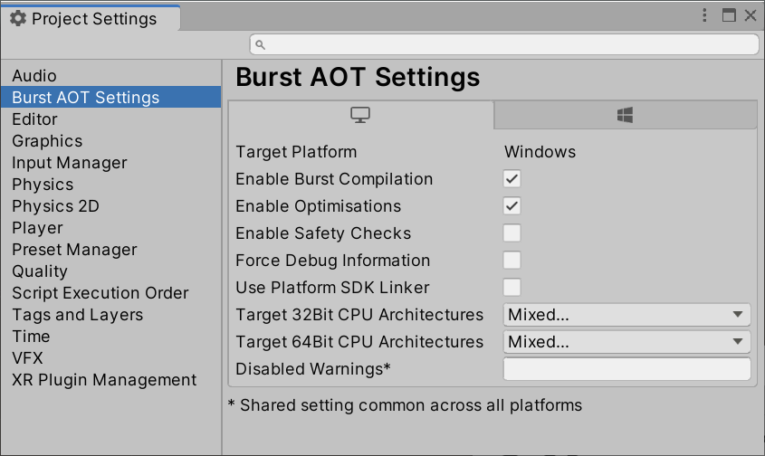

# Standalone Player Support

The Burst compiler supports Standalone Players - see [Burst AOT Requirements](#burst-aot-requirements)

# Usage

When Burst compiles code for the Standalone Player, with the exception of iOS, it will create a single dynamic library and place it into the standard plugins folder for that particular player type. e.g. on Windows, it is in the path `Data/Plugins/lib_burst_generated.dll` 
This library is loaded by the Job system runtime the first time a Burst compiled method is invoked.

For iOS, static libraries are generated instead, due to requirements for submitting to Test Flight.

Prior to Unity 2019.1, the settings for AOT compilation are shared with the [Jobs Menu](QuickStart.md#jobs-burst-menu). 
In later Unity versions (2019.1 and beyond), the settings for AOT compilation are configured via [Burst AOT Settings](#burst-aot-settings).

# Burst AOT Settings

When a project uses AOT compilation, you can control Burst behavior using the **Burst AOT Settings** section of the **Project Settings** window. The AOT settings override the Burst settings on the **Jobs** menu when you make a standalone build of your project.

- **Target Platform**: Shows the current desktop platform - can be changed via the Unity Build Settings.. dialog.
- **Enable Burst Compilation**: Turns Burst entirely on/off for the currently selected platform.
- **Enable Optimizations**: Turns Burst optimizations on/off.
- **Enable Safety Checks**: Turns Burst safety checks on/off.
- **Force Debug Information**: Forces Burst to generate debug information (even in release Standalone Player builds). Care should be taken not to accidentally ship a build containing symbols.
- **Use Platform SDK Linker**: Disables cross compilation support (Only applicable to Windows/macOS/Linux Standalone Players) (see [Burst AOT Requirements](#burst-aot-requirements)).
- **Target 32Bit CPU Architectures**: Allows you to specify the CPU architectures supported for 32 bit builds (shown when supported). The default is SSE2 and SSE4 selected.
- **Target 64Bit CPU Architectures**: Allows you to specify the CPU architectures supported for 64-bit builds (shown when supported). The default is SSE2 and AVX2 selected.
- **Disabled Warnings**: Allows you to specify a list of Burst warnings that should be disabled for a player build. Passed as a semi-colon seperated list.

CPU Architecture is currently only supported for Windows, macOS, and Linux. Burst will generate a Standalone Player that supports the CPU architectures you have selected. A special dispatch is generated into the module, so that the code generated will detect the CPU being used and select the appropriate CPU architecture at runtime.

You can set the Burst AOT settings as required for each of the supported platforms. The options are saved per platform as part of the project settings.

**Note:** The Burst AOT Settings are available in Unity 2019.1+.

# Burst AOT Requirements

## Desktop platforms with cross compilation enabled (the default behaviour)

Burst compilation for desktop platforms (macOS, Linux, Windows) no longer requires external toolchain support when building a Standalone Player (since Burst 1.3.0-preview.1). This should work out of the box, but can be disabled in [Burst AOT Settings](#burst-aot-settings) if needed.

## Other platforms and desktops when cross compilation is disabled

If compiling for a non desktop platform, or you have disabled cross compilation support, then Burst compilation requires specific platform compilation tools (similar to IL2CPP), the below table can be used to determine the current level of support for AOT compilation.
- If a host/target combination is not listed, it is at present not supported for Burst compilation.
- If a target is not valid (missing tools/unsupported), Burst compilation will not be used (may fail), but the target will still be built without Burst optimisations.

 
<table>
  <tr>
    <th>Host Editor Platform</th>
    <th>Target Player Platform</th>
    <th>Supported CPU Architectures</th>
    <th>External Toolchain Requirements</th>
  </tr>
  <tr>
    <td>Windows</td>
    <td>Windows</td>
    <td><code>x86 (SSE2, SSE4)</code>, <code>x64 (SSE2, SSE4)</code></td>
    <td>Visual Studio (can be installed via Add Component in Unity Install) and C++ Build Tools for Visual Studio (use Visual Studio Installer to add this). Windows 10 SDK</td>
  </tr>
  <tr>
    <td>Windows</td>
    <td>Universal Windows Platform</td>
    <td><code>x86 (SSE2, SSE4)</code>, <code>x64 (SSE2, SSE4)</code>, <code>ARM32 Thumb2/Neon32</code>, <code>ARMV8 AARCH64</code></td>
    <td>Visual Studio 2017 Universal Windows Platform Development Workflow C++ Universal Platform Tools</td>
  </tr>
  <tr>
    <td>Windows</td>
    <td>Android</td>
    <td><code>x86 SSE2</code>, <code>ARM32 Thumb2/Neon32</code>, <code>ARMV8 AARCH64</code></td>
    <td>Android NDK 13 or higher - It is preferred to use the one installed by Unity (via Add Component). Will fall back to the one specified by ANDROID_NDK_ROOT environment variable if the Unity external tools settings are not configured.</td>
  </tr>
  <tr>
    <td>Windows</td>
    <td>Magic Leap</td>
    <td><code>ARMV8 AARCH64</code></td>
    <td>Lumin SDK must be installed via Magic Leap Package Manager and configured in the Unity Editor's External Tools Preferences.</td>
  </tr>
  <tr>
    <td>Windows</td>
    <td>Xbox One</td>
    <td><code>x64 SSE4</code></td>
    <td>Visual Studio 2015 or Visual Studio 2017 Microsoft XDK</td>
  </tr>
  <tr>
    <td>Windows</td>
    <td>PS4</td>
    <td><code>x64 SSE4</code></td>
    <td>Minimum PS4 SDK version 5.0.0</td>
  </tr>
  <tr>
    <td>Windows</td>
    <td>Nintendo Switch</td>
    <td><code>ARMV8 AARCH64</code></td>
    <td>Minimum Nintendo Switch NDK 8.2.0 Requires 2019.3 Unity Editor or greater</td>
  </tr>
  <tr>
    <td>macOS</td>
    <td>macOS</td>
    <td><code>x86 (SSE2, SSE4)</code>, <code>x64 (SSE2, SSE4)</code></td>
    <td>Xcode with command line tools installed (xcode-select --install)</td>
  </tr>
  <tr>
    <td>macOS</td>
    <td>iOS</td>
    <td><code>ARM32 Thumb2/Neon32</code>, <code>ARMV8 AARCH64</code></td>
    <td>Xcode with command line tools installed (xcode-select --install) Requires Unity 2018.3.6f1+ or Unity 2019.1.0b4 or later</td>
  </tr>
  <tr>
    <td>macOS</td>
    <td>Android</td>
    <td><code>x86 SSE2</code>, <code>ARM32 Thumb2/Neon32</code>, <code>ARMV8 AARCH64</code></td>
    <td>Android NDK 13 or higher - It is preferred to use the one installed by Unity (via Add Component). Will fall back to the one specified by ANDROID_NDK_ROOT environment variable if the Unity external tools settings are not configured.</td>
  </tr>
  <tr>
    <td>macOS</td>
    <td>Magic Leap</td>
    <td><code>ARMV8 AARCH64</code></td>
    <td>Lumin SDK must be installed via Magic Leap Package Manager and configured in the Unity Editor's External Tools Preferences.</td>
  </tr>
  <tr>
    <td>Linux</td>
    <td>Linux</td>
    <td><code>x86 (SSE2, SSE4)</code>, <code>x64 (SSE2, SSE4)</code></td>
    <td>Clang or Gcc tool chains.</td>
  </tr>
</table>

**Notes:**

- Burst now supports cross compilation between desktop platforms (macOS/Linux/Windows) by default.
- The UWP build will always compile all four targets (x86, x64, ARMv7 and ARMv8).

# Burst Targets

When Burst compiles for multiple targets during an AOT build, it has to do seperate compilations underneath to support this. For example, if you were compiling for `X64_SSE2` and `X64_SSE4`, the compiler will have to do two separate compilations underneath to generate code for each of the targets you choose.

To keep the combinations of targets to a minimum, we make certain Burst targets require multiple processor instruction sets underneath:

- `SSE4.2` is gated on having `SSE4.2` and `POPCNT` instruction sets.
- `AVX2` is gated on having `AVX2`, `FMA`, `F16C`, `BMI1`, and `BMI2` instruction sets.
