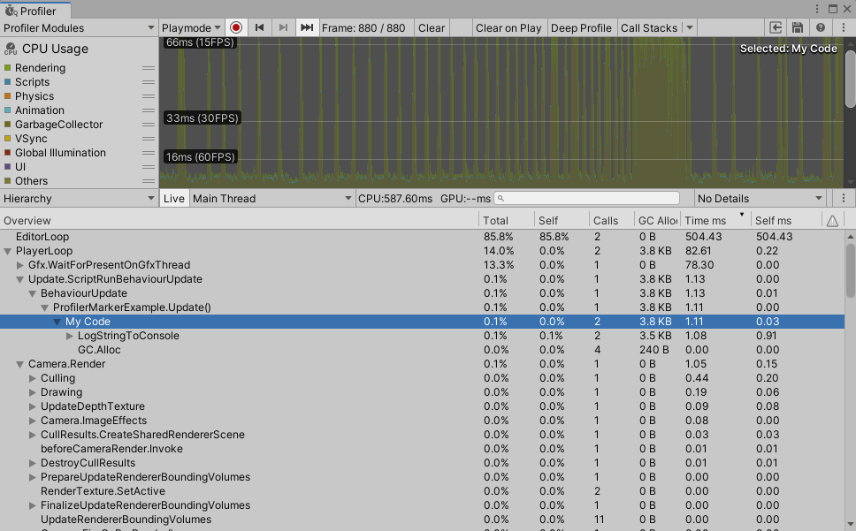
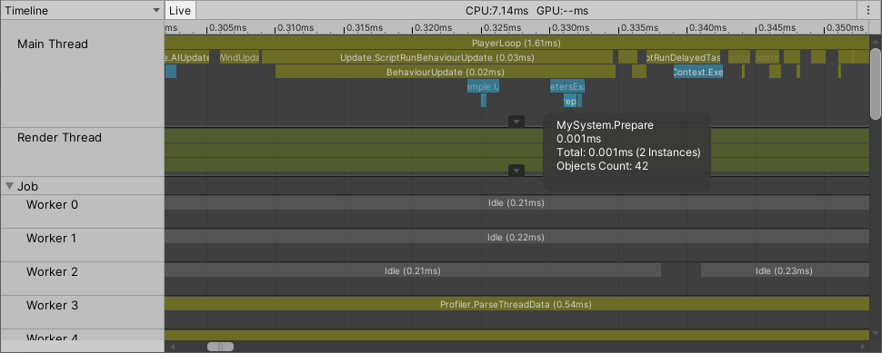
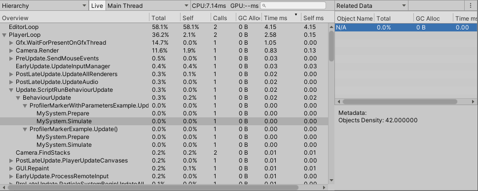

# ProfilerMarker API guide

Use ProfilerMarker to mark up resource-intensive script code blocks and make them visible in the Unity Profiler.

This can be useful because by default, the built-in Unity Profiler does not profile all method calls. Also, if you enable **Deep Profiling**, it causes a large overhead that significantly slows down your application execution and skews the results.

To use the [ProfilerMarker API](https://docs.unity3d.com/ScriptReference/Unity.Profiling.ProfilerMarker.html), start your code with `ProfilerMarker.Begin()` and end it with `ProfilerMarker.End()` like the following: 

```C#
using UnityEngine;
using Unity.Profiling;

public class ProfilerMarkerExample
{
    static readonly ProfilerMarker k_MyCodeMarker = new ProfilerMarker("My Code");

    void Update() {
        k_MyCodeMarker.Begin();
        Debug.Log("This code is being profiled");
        k_MyCodeMarker.End();
    }
}
```

Unity then records and reports that code block's execution time to the Profiler, and displays it in the [CPU Profiler module](https://docs.unity3d.com/Manual/ProfilerCPU.html) without the need to use Deep Profiling. It displays it as a new entry in the **Hierarchy View** of the CPU Profiler module, as follows:

<br/>*Profiler sample in Profiler Window.*

You can also capture this information with the [Recorder profiling API](https://docs.unity3d.com/ScriptReference/Profiling.Recorder.html). During development in the Editor and in Development Players, you can use it to get a performance overview of the different parts of your code and to identify performance issues.

You can add as many Profiler samples as you like: these calls have zero overhead when Unity deploys them in a non-development build. `Begin` and `End` methods are marked with ConditionalAttribute. Unity conditionally compiles them away, and as such, they have zero execution overhead in non-developmenet (Release) builds. The marker field will be present in release build though, taking up memory for it's IntPtr, i.e. 8 Byte.

`ProfilerMarker` represents a named Profiler handle and is the most efficient way of profiling your code. You can use it in any C# code of your application.

## How to add instrumentation to C# code

You can also use `ProfilerMarker.Auto()` in your code to ensure that `ProfilerMarker.End()` is automatically called at the end of the code block. The following calls are equivalent:

```C#
using Unity.Profiling;

public class MySystemClass
{
    static readonly ProfilerMarker k_UpdatePerfMarker = new ProfilerMarker("MySystem.Update");

    public void Update()
    {
        k_UpdatePerfMarker.Begin();
        // ...
        k_UpdatePerfMarker.End();

        using (k_UpdatePerfMarker.Auto())
        {
            // ...
        }
    }
}
```

`ProfilerMarker.Auto()` can not be compiled out in non-development (Release) builds but just returns null and thus adding minimal overhead.

## How to add integer or floating point parameters to instrumentation sample

Sometimes you might want to provide additional context to your code samples, to identify specific conditions on why the code might have been running for a long time. For example, if your system is carrying out simulations of a number of objects, you can pass the number of objects with a Profiler sample. If you then see an abnormal number along with a long sample duration, that might mean you have to use another thread for simulation or split the CPU work across multiple frames (timeslicing) or even do a game design adjustments to prevent frame drops.

```C#
using Unity.Profiling;

public class MySystemClass
{
  static readonly ProfilerMarker<int> k_PreparePerfMarker = new ProfilerMarker<int>("MySystem.Prepare", "Objects Count");
  static readonly ProfilerMarker<float> k_SimulatePerfMarker = new ProfilerMarker<float>(ProfilerCategory.Scripts, "MySystem.Simulate", "Objects Density");

  public void Update(int objectsCount)
  {
    k_PreparePerfMarker.Begin(objectsCount);
    // ...
    k_PreparePerfMarker.End();

    using (k_SimulatePerfMarker.Auto(objectsCount * 1.0f))
    {
      // ...
    }
  }
}
```

**Note:** The ProfilerMarker supports up to three numeric parameters: [ProfilerMarker\<TP1\>](../api/Unity.Profiling.ProfilerMarker-1.html), [ProfilerMarker\<TP1, TP2\>](../api/Unity.Profiling.ProfilerMarker-2.html) and [ProfilerMarker\<TP1, TP2, TP3\>](../api/Unity.Profiling.ProfilerMarker-3.html).

## How to add string parameter to instrumentation sample

Similarly, when you load level or data files you might want to see the name of the level or file which took longer than expected to process. Use [ProfilerMarkerExtension](../api/Unity.Profiling.ProfilerMarkerExtension.html) methods to pass a string parameter along with a Profiler sample:

```C#
using Unity.Profiling;

public class MySystemClass
{
  static readonly ProfilerMarker k_PreparePerfMarker = new ProfilerMarker("MySystem.Prepare");

  public void Prepare(string path)
  {
    k_PreparePerfMarker.Begin(path);
    // ...
    k_PreparePerfMarker.End();
  }
}
```

## Where to see the sample parameters in Profiler Window

The samples that `ProfilerMarker.Begin()/End()` or `ProfilerMarker.Auto` generates are visible in **Timeline View** and **Hierarchy View** of the CPU module in the Profiler Window.

<br/>*Profiler sample with metadata in Timeline View.*


<br/>*Profiler sample with metadata in Hierarchy View.*
